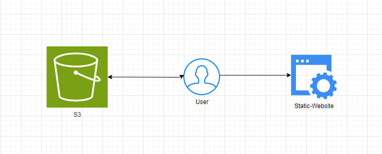
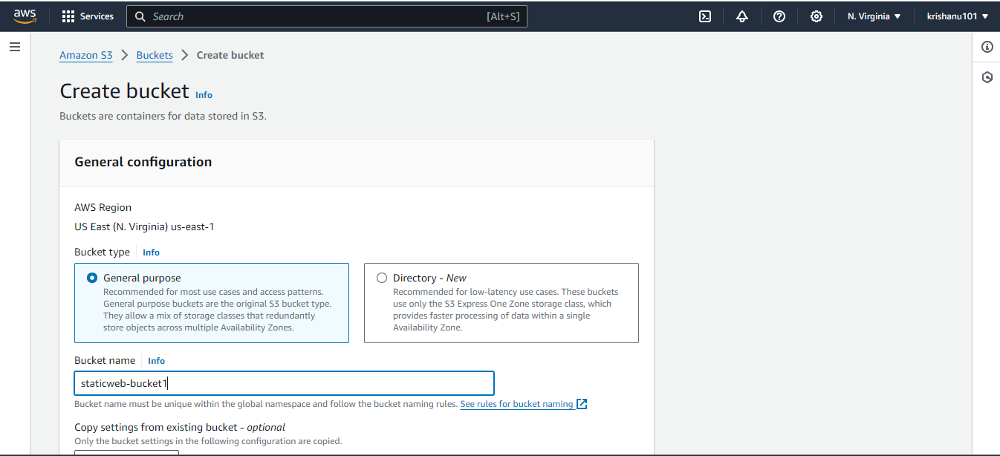
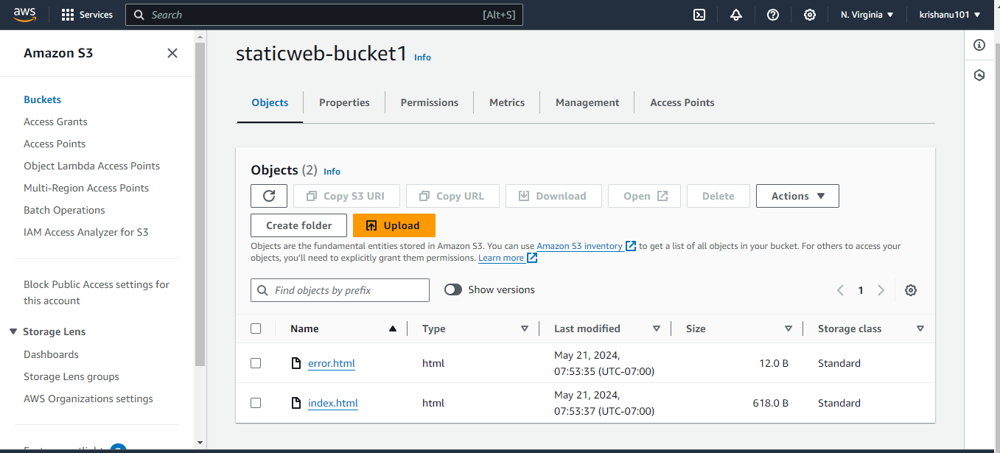
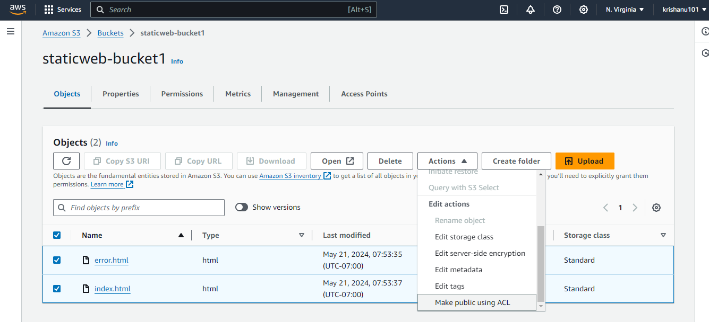
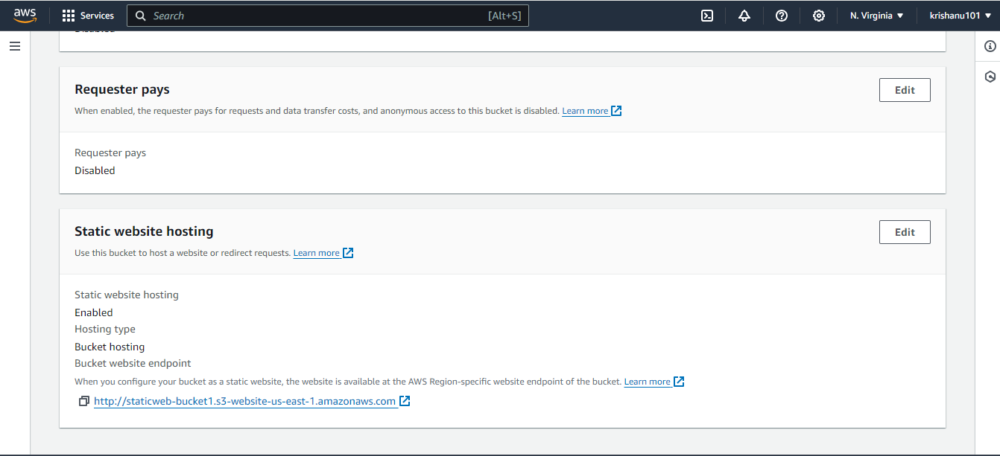
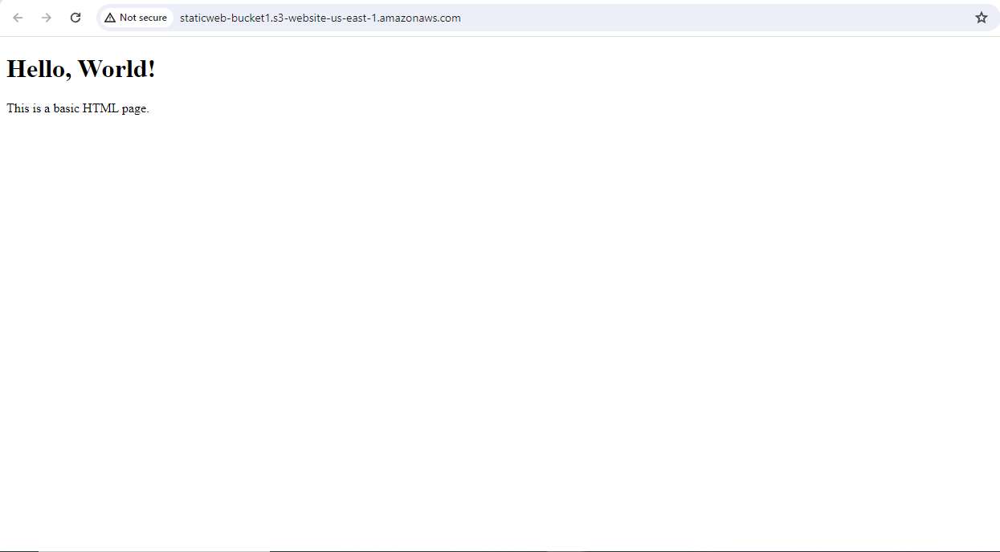

---

#Static Website Hosing on AWS

##Project Overview
this is project demonstrates how to a static HTML webpage on AWS.The architechcture ensures high availity,fault tolerance and scalability by leveraging various AWS service.

1.Sign in to the AWS Management Console: Go to the AWS Management Console and sign in to your AWS account.

2.Open the S3 Console: Navigate to the S3 service by either searching for it in the services menu or clicking on the S3 icon if it's available on your dashboard.

3.Create a Bucket: Click on the "Create bucket" button. Choose a unique name for your bucket, keeping in mind that S3 bucket names must be globally unique. Select the region where you want your bucket to be located, and leave other settings as default. Click "Create".

4.Enable Static Website Hosting: Once your bucket is created, select it from the list and navigate to the "Properties" tab. Scroll down to find the "Static website hosting" card, and click on it. Choose the option to enable static website hosting. Enter the index document (e.g., index.html) and the error document if you have one (e.g., error.html). Click "Save".

5.Upload Your Website Content: Go to the "Overview" tab and click on the "Upload" button. Upload all your website files, including HTML, images, etc., into the bucket.

6.Set Permissions: After uploading your files, select them all by clicking the checkbox next to each file. Then, click on the "Actions" dropdown menu and choose "Make public". This ensures that your files are accessible to everyone over the internet.

7.Access Your Website: Once your files are uploaded, S3 provides a website endpoint URL. You can find this URL in the "Static website hosting" card under the "Properties" tab. It will be something like `http://your-bucket-name.s3-website-region.amazonaws.com`. You can use this URL to access your website.

8.Test Your Website: Open a web browser and enter the website endpoint URL you obtained in the previous step. If everything is configured correctly, you should see your website live on the internet.

That's it! Your static website is now deployed and hosted on AWS S3.
